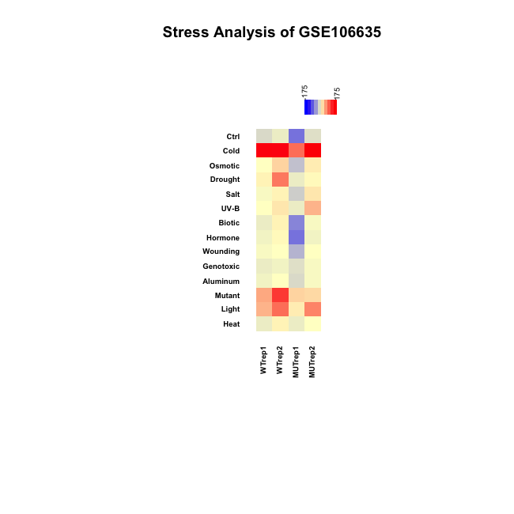

```{r setup, include = FALSE}
knitr::opts_chunk$set(
  collapse = TRUE,
  comment = "#>"
)
```

PlantPhysioSpace is a R data package which provides plant stress spaces to be used with the package [PhysioSpaceMethods](https://github.com/JRC-COMBINE/PhysioSpaceMethods) for in depth analysis of plant response to different types of stress.

#### Table of Contents
**[Installation Instructions](#installation-instructions)**<br>
**[Usage Instructions](#usage-instructions)**<br>

### Installation Instructions
It is recommended to install [PhysioSpaceMethods](https://github.com/JRC-COMBINE/PhysioSpaceMethods) before PlantPhysioSpace. More information about how to install PhysioSpaceMethods is provided in https://github.com/JRC-COMBINE/PhysioSpaceMethods.

#### Installing via Devtools (Recommended method):
Easiest way to install PlantPhysioSpace is via <a href="https://cran.r-project.org/web/packages/devtools/">Devtools</a>.
After installing Devtools from cran, you can install PlantPhysioSpace by:
```r
devtools::install_github(repo = "JRC-COMBINE/PlantPhysioSpace", build_vignettes = TRUE)
```

#### Alternative installation methods (Manual download):
In case you encountered any problem while installing PlantPhysioSpace, you can download the repository first and 
install the package from downloaded local files.
In your terminal, first clone the repository in your desired repository:
```Shell
cd [Your desired directory]
git clone https://github.com/JRC-COMBINE/PlantPhysioSpace.git
```
Then install the downloaded package using <a href="https://cran.r-project.org/web/packages/devtools/">Devtools</a>:
```Shell
R -e "devtools::install_local('./PlantPhysioSpace/', build_vignettes = TRUE)"
```

### Usage Instructions
PlantPhysioSpace can map user samples inside a physiological space, calculated prior from a compendium of known samples. Here we demonstrate the power of the method with few examples.

#### Example One: GSE106635
The first dataset we will analyse is <a href="https://www.ncbi.nlm.nih.gov/geo/query/acc.cgi?acc=GSE106635">
GSE106635</a> from NCBI's <a href="https://www.ncbi.nlm.nih.gov/geo/">
Gene Expression Omnibus or GEO</a>.

There are numerous ways to acquire a dataset from GEO, for example by using <a href="https://bioconductor.org/packages/release/bioc/html/GEOquery.html">GEOquery</a>. Here we directly download 
the CEL files and normalise them with <a href="https://www.bioconductor.org/packages/release/bioc/html/affy.html">affy</a> package:
```r
#Download and untar:
download.file(url = "https://www.ncbi.nlm.nih.gov/geo/download/?acc=GSE106635&format=file",
              destfile= "GSE106635_RAW.tar") # We're downloading into the working directory, obviously using any other directory is possible.
untar(tarfile = "GSE106635_RAW.tar", exdir = "GSE106635_RAW")

#Normalising:
require(affy)
GSE106635ESet <-
  justRMA(
    filenames = list.files(path = "GSE106635_RAW", full.names = T)
  )
```

After downloading and normalising the data, we need to take four important steps before using the data as
input for PlantPhysioSpace.

* Convert gene expression data into a matrix: PlantPhysioSpace expects a matrix as the input. Right now GSE106635ESet is an 
expression set so first we have to convert it to a matrix:
```r
#Converting expression set to matrix:
GSE106635ESetExp <- exprs(GSE106635ESet)
```

* Have genes in rows and samples in columns, with Entrez IDs in rownames: After converting our gene expression data 
into a matrix, we have to make sure we have genes in rows and samples in columns, which in our case we already have 
in GSE106635ESetExp. But in rownames of the matrix, there are Affymetrix Arabidopsis ATH1 Genome Array IDs, which we 
have to convert to Entrez IDs. Again there are numerous ways to for this conversion, for example using the 
<a href="https://www.ncbi.nlm.nih.gov/geo/query/acc.cgi?acc=GPL198">GPL file</a> specific to ATH1 Genome Array, or using 
Ensembl's <a href="https://www.ensembl.org/biomart/">BioMart</a> or <a href="https://bioconductor.org/packages/release/bioc/html/biomaRt.html">biomaRt's package</a> in R.
Here we used the conversion table downloaded directly from affymetrix website:
```r
#Converting AffyID to EntrezID:
ATH1ChipInfo <- read.delim(file = "data-raw/Arabidopsis/AT-raw/ArabidopsisATH1GenomeArray.txt",
                           header = T, skip=18)
rownames(GSE106635ESetExp) <- ATH1ChipInfo$Entrez.Gene[match(x = rownames(GSE106635ESetExp),
                                                          table = ATH1ChipInfo$Probe.Set.ID)]
GSE106635ESetExp <- GSE106635ESetExp[rownames(GSE106635ESetExp)!="---",]
```

* Have **RELATIVE** values for gene expression: PhysioSpace method expects relative values as input, i.e. assuming the most 
postive values correspond to up-regulated genes and most negative values correspond to down-regulated genes. Easiest way to 
calculate this relative value is by calculating fold change:
```r
#Calculating Fold-Changes:
GSE106635FC <- GSE106635ESetExp[,5:8] - GSE106635ESetExp[,1:4]
```
(although there are more sophisticated ways for this calculation,
for example by calculating the signed p value in logarithm scale, which will come later in this vignette).

* Writing sample names in colnames: this step is not necessary for proper calculation, but will help in proper inference of
the result matrix, so it is highly recommended. Sample names should be short, and to the point. In GSE106635 that we are about 
to analyse, there are 4 samples (excluding the controls), two replicates of wild type Col-0 under cold stress, and two 
replicates of TabZIP6-overexpressed Arabidopsis line (L20) under the same cold stress. So we will name these samples
as folows:
```r
#Writing samples names into colnames:
colnames(GSE106635FC) <- c("WTrep1","WTrep2","MUTrep1","MUTrep2")
```

Now that we prepared the proper input for PlantPhysioSpace, the main calculation can be done easily by using the function
calculatePhysioMap():
```r
#Main calculation:
library(PhysioSpaceMethods)
library(PlantPhysioSpace)
RESULTS <- calculatePhysioMap(InputData = GSE106635FC, Space = AT_Stress_Space)
```
Note that calculatePhysioMap() has to have at least two inputs: 'InputData' which in our case is the fold change matrix, and
'Space' which is the Physiology Space we want the InputData to be mapped in. Here we used AT_Stress_Space, which is already 
included in PlantPhysioSpace package. For more information about the available Spaces in the package, detail explanation about
AT_Stress_Space and information about other input options of calculatePhysioMap() we recommend the reader to check the documentation
of the package.

The output of calculatePhysioMap(), which here we called 'RESULTS', is a matrix with the same number of columns as the number of 
samples(Columns) we had in 'InputData', and the same number of rows as the number of dimensions(Columns) we had in the 'Space'. The 
value in row M and Column N in RESULTS is the mapped values of Nth sample on Mth dimension of the Space.

In our case we had samples under cold stress condition, so we expect to see high values (similarities) on the 'Cold' dimension of 
the AT_Stress_Space:
```r
#Plotting the results:
PhysioHeatmap(PhysioResults = RESULTS, main = "Stress Analysis of GSE106635", SymmetricColoring = T, SpaceClustering = T, Space = AT_Stress_Space)
```


In the output you can clearly see all samples have their highest value on Cold stress dimension.
For more information about PhysioHeatmap() check PhysioSpaceMethods package documentation.

#### Example Two: GSE93420

#### Example Three:
